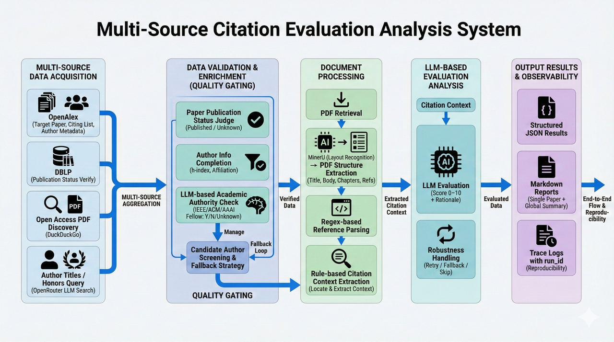
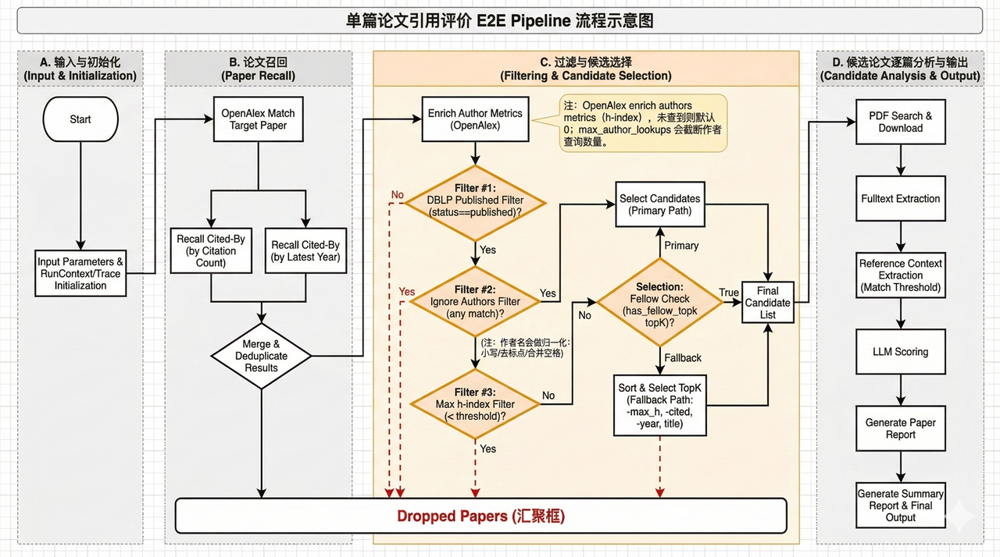

# PaperCitedRemarkAnalysis

End-to-end pipeline to analyze how influential citations (Fellow authors) refer to a target paper.
Given a target paper title, the system pulls citing papers, filters for published works,
checks Fellow status for top authors, extracts citation contexts from PDFs, scores each
context with an LLM, and outputs reports plus trace logs for reproducibility.



## Table of Contents

- Overview
- Key Features
- Pipeline Overview (T1-T9)
- Requirements
- Installation and Setup
- Quick Start
- Outputs
- FAQ

## Overview

This project analyzes citations to a specified target paper, focusing on how influential authors
(e.g., IEEE/ACM/AAAI Fellows) refer to it and the semantic stance of their remarks. The system
automatically collects citing papers, filters for published works, identifies influential authors,
extracts citation contexts from PDFs, scores each context with an LLM, and generates reproducible
reports and trace logs.

## Key Features

- Automatic retrieval of the target paper and its citing papers
- Author metrics enrichment and Fellow status verification
- Full-text PDF extraction and citation-context extraction
- LLM-based scoring and report generation
- End-to-end trace logs for reproducibility

## Pipeline Overview (T1-T9)

1. RunContext initialization and parameter snapshot (run_id, directories, trace)
2. OpenAlex title match (target paper id/doi)
3. Cited-by retrieval (TopK)
4. DBLP publication status check (keep published only)
5. Author metrics enrichment (h-index, affiliation)
6. TopK author Fellow verification (IEEE/ACM/AAAI)
7. Candidate paper selection and fallback strategy (max h-index)
8. PDF download, full-text extraction, citation-context extraction
9. LLM scoring and report output (per-paper report + summary report)



## Requirements

- Linux
- Conda
- Python 3.10
- Chrome and Chromedriver (for `pcra.get_pdf`)
- minerU service (for PDF structured parsing; 5GB GPU VRAM recommended)
- Network access to DuckDuckGo (proxy required)

## Installation and Setup

### 1. Python environment and dependencies

```bash
conda create -n pcraPaper python=3.10
conda activate pcraPaper
pip install -r requirements.txt
```

### 2. Chrome / Chromedriver (Selenium)

`pcra.get_pdf` requires Chrome and chromedriver binaries at fixed paths under the repo root:

- `chrome_bin/chrome-linux64/chrome`
- `chrome_bin/chromedriver-linux64/chromedriver`

These files come from the official **Chrome for Testing** release. Download the matching
versions of `chrome-linux64.zip` and `chromedriver-linux64.zip`, then extract them into
`chrome_bin/`.

Example (version number can be replaced):

```bash
VER=143.0.7499.40
mkdir -p chrome_bin
wget -O /tmp/chrome-linux64.zip "https://storage.googleapis.com/chrome-for-testing-public/${VER}/linux64/chrome-linux64.zip"
wget -O /tmp/chromedriver-linux64.zip "https://storage.googleapis.com/chrome-for-testing-public/${VER}/linux64/chromedriver-linux64.zip"
unzip -q /tmp/chrome-linux64.zip -d chrome_bin
unzip -q /tmp/chromedriver-linux64.zip -d chrome_bin
```

Verify versions:

```bash
chrome_bin/chrome-linux64/chrome --version
chrome_bin/chromedriver-linux64/chromedriver --version
```

### 3. minerU environment and service startup

```bash
conda create -n MinerUService python=3.12
conda activate MinerUService

export UV_DEFAULT_INDEX=https://mirrors.aliyun.com/pypi/simple/

pip install uv -i https://pypi.org/simple/
uv pip install "mineru[core]"

# On first run, use a mirror to download required model files,
# then convert a file to trigger downloading all models
export MINERU_MODEL_SOURCE=modelscope
mineru -p <input_path> -o <output_path>

# Choose a directory for temporary files, then start minerU there
cd <minerUtemp>
export MINERU_MODEL_SOURCE=modelscope
mineru-api --host 0.0.0.0 --port 18543
```

Service port: `18543`.

### 4. LLM API Key configuration

Find the config template `config/llm_model_template.yaml`:

```bash
cp config/llm_model_template.yaml config/llm_model.yaml
```

Fill in the `text` model settings first (can be local Ollama or any OpenAI-compatible API).
Fellow lookup mode is configured by `fellow_lookup.mode`:
- `local_only` (default): DuckDuckGo + Selenium + local `text` model, no OpenRouter required.
- `local_with_fallback`: local flow first, fallback to OpenRouter when all results are `Unknown` or local errors occur.
- `openrouter_only`: legacy OpenRouter web-search flow only.

`openrouter_web_search` is only required when mode is `local_with_fallback` or `openrouter_only`.

## Quick Start

### 1. Analyze a single paper

```bash
conda activate pcraPaper
bash e2e_scripts/run_one_paper/run_one_paper.sh
```

Before running, set the following variables in `e2e_scripts/run_one_paper/run_one_paper.sh`:

```bash
# Target paper (cited) title
PAPER_TO_ANALYZE="Efficient Personalized PageRank Computation: The Power of Variance-Reduced Monte Carlo Approaches"
# Target paper author
TARGET_AUTHOR="Rong-Hua Li"
# Authors to ignore (citing papers that include these authors will be skipped)
IGNORE_AUTHORS='["Guoren Wang","Rong-Hua Li"]'
# Custom ID for later aggregation
RUN_ID="102"
```

Default output location: `trace_log/`.
It is recommended to run with `tmux` in the background. A single paper takes about 5 minutes.

### 2. Aggregate results for multiple papers

Aggregate results under `trace_log/` into Excel:

```bash
conda activate pcraPaper
python e2e_scripts/export_result/export_summary_to_excel.py
```

## Outputs

Results and logs for a single paper are located at `trace_log/<target_paper_name>/`:

- `res/paper_ref_contexts/{paper_id}.json` (PDF, full text, citation contexts)
- `res/paper_ref_contexts_scored/{paper_id}.json` (LLM scores)
- `res/fulltext/{paper_id}.md`
- `res/pdf/{paper_id}.pdf`
- `res/reports/paper/{paper_id}.md`
- `res/reports/summary.md`
- `res/summary.json`
- `log/{run_id}.ndjson` (stage trace logs)

Aggregated results for multiple papers are in: `e2e_scripts/export_result`.

## FAQ

- Cannot access DuckDuckGo: configure a proxy and set related environment variables.
- Chrome or Chromedriver version mismatch: ensure both versions match and are placed in `chrome_bin/`.
- minerU service unavailable: confirm port `18543` is running and that the runtime has GPU access.
